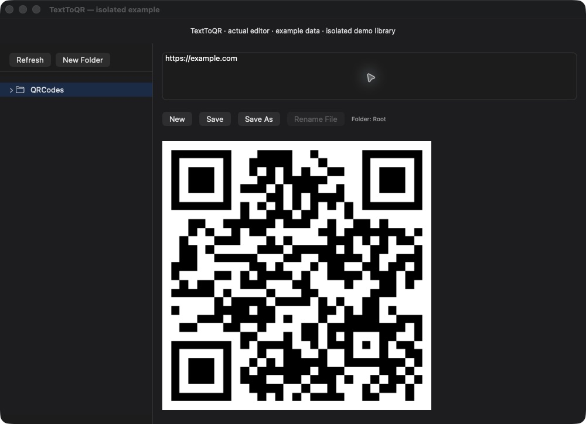

# TextToQR

Turn text into QR codes on your Mac and keep reusable entries in a local folder library. TextToQR is a small SwiftUI utility for people who repeatedly generate codes from saved snippets, with CSV import/export for the text library.

[Build from source](#build-from-source) · [Existing download](https://github.com/user-attachments/files/22369243/QRCodeGenerator.zip) · [Questions and feedback](https://github.com/chandanankush/TextToQR/discussions)



*Actual editor compiled unchanged in a local harness with a separate demo library. The QR contains invented public example text. [Short live-preview walkthrough](docs/assets/texttoqr-demo.gif) uses two captured states with condensed timing.*

## What you can do

- Type ASCII text and see a QR preview immediately, without saving.
- Save text entries (`.txt`, `.qr`, `.qrtext`) in app-managed folders and reopen them later.
- Create subfolders and rename saved entries.
- Export or import the text library as CSV. This exports text, not QR image files.

## Build from source

The project targets **macOS 13.3+**. You need Xcode with the macOS SDK; the current source is the authoritative version.

```sh
git clone https://github.com/chandanankush/TextToQR.git
cd TextToQR
open QRCodeGenerator/QRCodeGenerator.xcodeproj
```

Select **QRCodeGenerator** and **My Mac**, then build and run. Choose a signing team if required. See the [development guide](docs/DEVELOPMENT.md) for source layout and sandbox details.

The [existing ZIP download](https://github.com/user-attachments/files/22369243/QRCodeGenerator.zip) is an unversioned archive linked by the earlier README, not a versioned GitHub Release. It has not been checked for source parity, signing, or notarization during this documentation work. See [release preparation](docs/RELEASE.md) for distribution steps.

## Use it

1. Type `https://example.com` in the editor. The QR preview updates as you type.
2. Choose **Save** or **Save As**, then enter a filename to keep the text in the app library.
3. Select a saved file to regenerate its QR; edit and **Save** to update it.
4. Use **File → Export Library…** to back up the text library, or **Import Library…** to merge a CSV snapshot.

Entries live under `Application Support/<bundle id>/QRCodes` inside the app container. Normal saving does not let you choose an arbitrary folder. CSV uses `folder,filename,text,order`: folders are relative to the library root and multiline text uses literal `\n`. Keep a backup before importing or clearing the library.

## Limitations

- **ASCII only.** The UI rejects non-ASCII text and truncates input beyond **1,273 bytes**.
- QR generation uses Core Image with correction level **H** and a roughly 300×300 preview. Size/correction controls and image export/copy are not currently exposed in the UI.
- A preview appearing does not guarantee every scanner can decode every payload. The repository has no automated test suite.
- Library files and CSV snapshots can contain sensitive text. Use invented values in screenshots and bug reports. **Clear Library…** removes the saved library; export a backup first.

## Support and contribution

Ask setup questions in [Discussions](https://github.com/chandanankush/TextToQR/discussions), starting with the [welcome thread](https://github.com/chandanankush/TextToQR/discussions/1). [Report reproducible problems](https://github.com/chandanankush/TextToQR/issues/new/choose) with sanitized input, macOS/Xcode version, and commit. See [troubleshooting](docs/TROUBLESHOOTING.md).

Read [CONTRIBUTING.md](CONTRIBUTING.md) and browse [good first issues](https://github.com/chandanankush/TextToQR/labels/good%20first%20issue) or [testing requests](https://github.com/chandanankush/TextToQR/labels/help%20wanted). Technical details and future ideas remain in [architecture](docs/ARCHITECTURE.md) and [development](docs/DEVELOPMENT.md).

## License

[GNU General Public License, version 3](LICENSE), as supplied by the existing license file.
